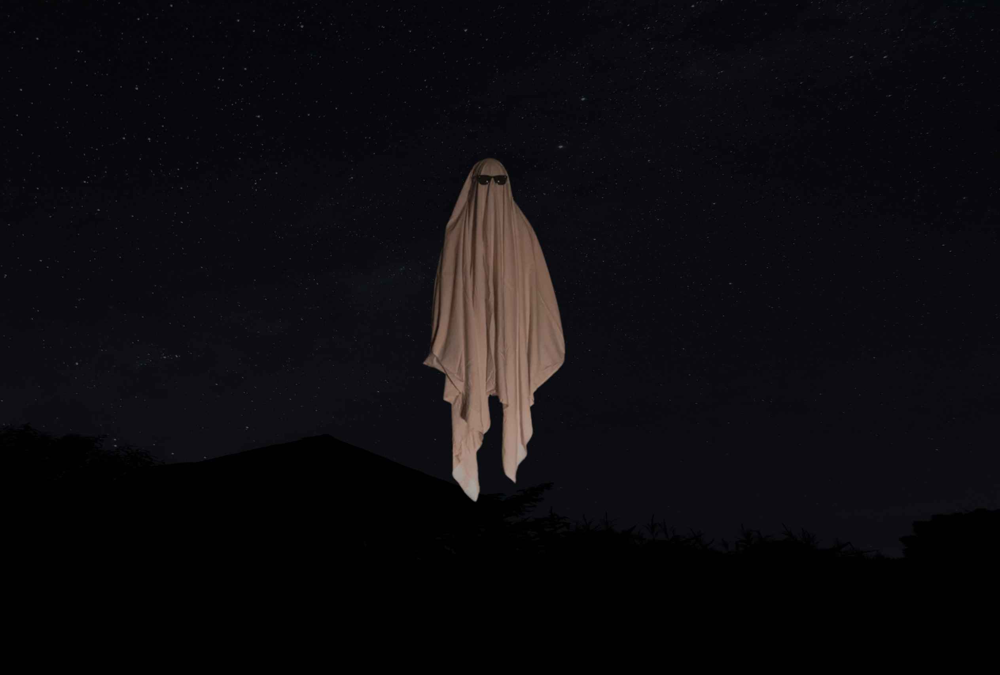

# Efeito Flutuação com CSS

Desenvolvido para aprendizado. Realizado efeito de flutuação com CSS. 19/10/22

[🔗 Clique aqui para acessar] (https://michel-maia.github.io/Efeito-Flutuacao-com-CSS/)

## 💻 Tecnologias

- HTML
- CSS

## Referência

- [Youtube] https://www.youtube.com/c/WillDev2022

- [css-tricks] https://css-tricks.com/almanac/properties/b/background-repeat/

- img https://unsplash.com/

